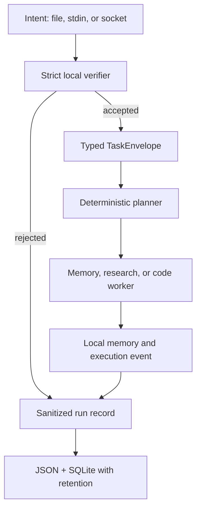

# A-Mind-OS Architecture

This document describes what exists on `Main`. Historical Refocus-OS research and future service sketches are inputs to the design, not proof that a component is implemented.

## Runnable local flow

Before the flow starts, the sensitive-content policy runs at the persistence boundary. `refuse` returns without writing; `redact` passes sanitized content to every backend. Research and code workers are deliberately bounded local placeholders and make no network or shell calls.

## Canonical boundaries

| Responsibility | Canonical module | Notes |
| --- | --- | --- |
| Paths, retention, sensitive-data policy | `python_core/refocus_core/persistence.py` | TOML + environment overrides; standard library only. |
| Memory API | `python_core/memory/memory_integration.py` | JSON fallback is default; optional local vector backends remain supported. |
| Intent verification and CLI | `services/orchestrator/local_demo.py` | Rejects malformed rules at startup. |
| Task schema | `services/orchestrator/task_schema.py` | Rejects invalid types instead of coercing them. |
| Planning, worker dispatch, task events | `services/orchestrator/orchestrator_service.py` | One planner/worker implementation. |
| Agent registration | `services/orchestrator/contract_registry.py` | Validates concrete agent contracts without `jsonschema`. |
| Admission, tool brokerage, budgets, lifecycle | `services/orchestrator/harness_runtime.py` | Implemented seams; not yet wired to OS processes. |
| Verification | `scripts/verify-repo.sh` and `tests/` | One dependency-free acceptance command and suite. |

Generated runtime state is never source code. `data/`, SQLite/JSONL files, sockets, and the shell activity feed are ignored so a clone starts from a deterministic baseline.

## Configuration and state

`config/refocus-os.toml` is committed policy, contains no secrets, and resolves relative persistence paths from the repository root. Environment variables may redirect all demo and memory state for testing or deployment. The demo uses one SQLite database with separate run and task-event tables, plus human-readable run JSON and execution JSONL.

The project-state compiler is a separate authority boundary. `tools/project-state/scripts/check_canonical_sources.py` must return the documented blocked status until complete versions of `governance/01_AUTHORITY_MATRIX.yaml` and `governance/02_PROJECT_REGISTRY.yaml` are present; fixtures must never be substituted.

## Implemented security properties

- Strict rule-file and task-envelope validation.
- Obvious-secret redaction or fail-before-write refusal.
- Explicit allowlist and audit primitives for future effects.
- Scoped admission, hard resource ceilings, and callable-only tool brokerage seams.
- Bounded recall context and offline default behavior.

These controls are safeguards, not a production security claim. JSON/SQLite data is not encrypted or tamper-evident, the socket is not authenticated, and the placeholder workers do not provide sandboxing.

## Planned architecture

The intended progression is: signed/admitted IPC → real sandboxed workers → model runtime → Hydra LangSec/CodeSec/SysSec services → OS-process supervision and eBPF telemetry → Tauri desktop shell. The committed systemd units and scoped `agents.md` files define vocabulary and ordering for that future work only. No planned layer may bypass the current rule that effects require deterministic admission and evidence.

## Authority invariant

AI may propose work, admitted workers may perform bounded effects, and the system records evidence. Stone remains final authority; no model, worker, evaluator, UI, or active harness silently promotes itself or changes canonical project state.
